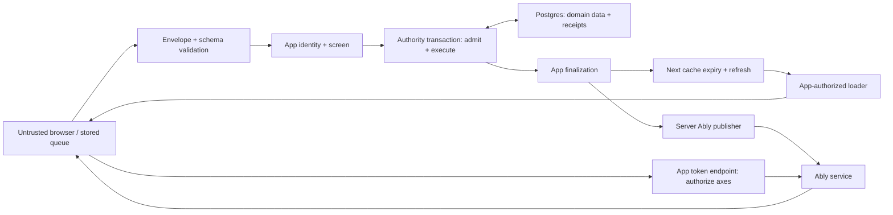

# Headcanon threat model

## 1. Overview

This reusable model covers the complete repository at clean Git revision `a2934a50b69a86af6973ef398ba87960b1195e00`. It is source-based architecture analysis, not a vulnerability audit. A fresh-context independent architecture review was reconciled with direct source inspection; its assets, boundaries, attacker capabilities, objectives, effective resources and open questions are retained below. No SECURITY.md policy was found. Documentation examples are integration guidance, not proof of a deployed application.

Headcanon is a TypeScript library for optimistic React/Next.js mutations. A browser predicts a write and sends an envelope. A generated Server Action validates it, derives an actor through application code, screens access, and asks an authority to execute or replay it. The Drizzle authority uses Postgres transactions and stored receipts. After acceptance, application finalization runs, Next cache tags expire, the route refreshes, and optional Ably messages prompt other clients to refresh. Application code owns sessions, permissions, domain writes, loaders, and infrastructure. (`README.md:7`, `src/next/server/action.ts:137`, `src/drizzle/authority.ts:330`.)

| Component | Role and evidence |
|---|---|
| Shared protocol and admission | Exact envelope checks, registered schema validation, canonical request identity: `src/core/authority.ts:578`, `src/core/authority.ts:663`, `src/core/canonical-invocation.ts:308`. |
| Server command boundary | Trusted actor callback, per-delivery screening, transaction-time admission and writes: `src/next/server/action.ts:144`, `src/server/binder.ts:124`. |
| Durable authority | Application-supplied database and actor scope; receipt lookup, locking, transactional write and receipt: `src/drizzle/authority.ts:330`. |
| Browser queue | Local optimistic state and optional JSON queue persistence: `src/react/ledger.ts:3`, `src/react/persistence.ts:69`. |
| Read and refresh | Application loaders supply canon; cache tagging and external-commit notification helpers: `src/next/server/revalidation.ts:39`, `src/next/server/revalidation.ts:141`, `src/next/server/revalidation.ts:156`. |
| Optional Ably | Server token signer/publisher and browser subscriptions: `src/ably/server.ts:148`, `src/ably/server.ts:214`, `src/ably/realtime-adapter.ts:327`. |
| Test and package workflows | Private Next fixture, in-memory authority, CI, package build: `fixture/package.json:5`, `fixture/lib/authority.ts:69`, `.github/workflows/ci.yml:1`, `package.json:80`. |

### Effective resources

| Deployment or workflow | Resource or capability | Configuration and precedence | Safe effective value or location | Readers, writers, or recipients | Enforcing control | Evidence or unknowns |
|---|---|---|---|---|---|---|
| Drizzle application | Domain database and receipts | Caller provides `options.db`; library defines no connection environment variable | Database and effective schema/search path selected by caller; unqualified receipt table `headcanon_mutation_receipts` | Application DB principal; DB operators/backups | DB permissions externally; transaction and receipt key internally | `src/drizzle/authority.ts:60`, `src/drizzle/authority.ts:337`, `src/drizzle/schema.ts:26`; deployed host/schema/credentials unknown |
| Receipt identity | Deduplication namespace | `options.scope(request.actor)`, then mutation UUID | Primary key `(actor_scope, mutation_id)`; stores protocol, full canonical invocation, fingerprint, outcome, time | Authority; anyone granted table read access | Exact canonical equality on replay; stable trusted scope required | `src/drizzle/authority.ts:333`, `src/drizzle/schema.ts:29`, `src/core/authority.ts:423`, `src/core/authority.ts:444` |
| Receipt cleanup | Deletion of expired receipts | Configured delivery age + clock tolerance + cleanup margin | Defaults: 7 days + 1 hour + 1 hour; at most 1,000 rows per call | Application cleanup job with DB authority | DB-clock cutoff, bounded batch, skip locked; consistent policy across servers required | `src/core/authority.ts:295`, `src/core/authority.ts:376`, `src/drizzle/authority.ts:265`, `src/drizzle/authority.ts:385` |
| Browser, no persistence | Pending mutations | Persistence omitted | Page memory | Current application browser context | Server still validates every delivery | `src/react/persistence.ts:110` |
| Browser, optional persistence | Pending envelope arguments | Caller-selected adapter/key; built-in adapter uses sessionStorage | `sessionStorage[key]`, plain JSON; removed when queue empty | Same-origin scripts in that tab; current application user | Envelope/schema validation on restore; no actor binding or encryption here | `src/react/persistence.ts:69`, `src/react/persistence.ts:170`; caller owns logout/key lifecycle |
| Cached Next loader | Canon data and invalidation tags | Caller supplies data/revisions and cache context | `headcanon:axis:v1:<SHA-256(axis)>`; up to 128 observed axes per helper call | Next cache; caller-authorized viewers | Revision validation and tag bound; permission and cache-key policy belong to app | `src/next/server/revalidation.ts:18`, `src/next/server/revalidation.ts:27`, `docs/loading-data.md:204` |
| Ably signing | Subscribe capability | Caller supplies REST client, approved axes, namespace; optional client ID and TTL | `<namespace>:headcanon:axis:v1:<SHA-256(axis)>`; exact subscribe-only grants | Signed request goes to browser and Ably; signing key stays with caller's REST client | Namespace validation and exact channel claims; app must authorize each requested axis | `src/ably/server.ts:189`, `src/ably/server.ts:214`, `src/ably/channel-names.ts:25`; actual key source/TTL unknown |
| Ably publication | Invalidation metadata | Caller-supplied REST client and deployment namespace | Event `headcanon.axis-invalidation.v1` with event ID, raw axis and revision | Ably and permitted subscribers; failure reporter receives stamp/error | Server publisher authority; batches of at most 100 channels; 1-second finalization wait, not cancellation | `src/ably/server.ts:92`, `src/ably/server.ts:159`, `src/next/server/revalidation.ts:72`; hashing is not confidentiality |
| Fixture dev and production test server | Test state and fault/reset controls | `next dev --port 3900` or `next start --port 3900`; Playwright uses localhost | Process-global in-memory fixture; HTTP port 3900; no explicit hostname constraint in scripts | Any caller able to reach fixture routes | No route authentication in test control handlers; deployment isolation required | `fixture/package.json:8`, `fixture/playwright.config.ts:4`, `fixture/lib/authority.ts:93`, `fixture/app/api/reset/route.ts:7`, `fixture/app/api/faults/route.ts:7`, `fixture/app/api/authority/route.ts:4` |
| Operator publication | Package distribution | Documented `npm publish` runs `prepack` build; registry follows operator npm configuration | Built `dist`, non-test `src`, `drizzle`, `docs` and standard npm metadata | Configured registry and package consumers | Operator registry permissions; package file allowlist; CI checks do not grant publish authority | `CONTRIBUTING.md:86`, `package.json:67`, `package.json:93`; registry identity and provenance unknown |
| CI and package build | Execution and retained test artifacts | Push/main or pull request CI; npm install/build/checks; prepack build | CI workspace; ephemeral Postgres test service; failure traces/reports retained 7 days | CI runner, artifact readers, package publisher | Repository/CI account permissions; package file allowlist; browser import checks | `.github/workflows/ci.yml:3`, `.github/workflows/ci.yml:14`, `.github/workflows/ci.yml:74`, `package.json:67`, `package.json:93`; no publication job in inspected workflow |

## 2. Threat Model, Trust Boundaries, and Assumptions

### Assets and objectives

Protect application records and permissions; actor/tenant separation; receipt integrity and retry semantics; confidential mutation arguments and refusal details; authorized canon reads; Ably signing/publish authority and activity metadata; service availability; and package integrity.

A prediction is not authorization. Every server delivery must derive its actor from trusted context and screen access, including receipt replay. New writes must preserve authorization at execution time. The adapter uses READ COMMITTED; merely reading permission during admission does not lock it. The application must use guarded writes or suitable locks. The documented example includes ownership and revision in the update predicate. (`src/next/server/action.ts:144`, `src/drizzle/authority.ts:381`, `docs/server-setup.md:110`, `docs/server-setup.md:139`.)

The same actor-scoped UUID and canonical invocation must replay one stored outcome without repeating domain writes. Different invocation content must fail. Refused or denied attempt writes roll back in a savepoint, while the terminal outcome is retained. The actor scope is not a data-access grant or an axis namespace. (`src/core/authority.ts:444`, `src/drizzle/authority.ts:173`, `src/drizzle/authority.ts:349`, `docs/server-setup.md:58`, `docs/loading-data.md:125`.)

### Actors and boundaries

- An unauthenticated caller, where a host exposes actions, can submit malformed envelopes and invoke host endpoints. An authenticated user can choose arguments, UUIDs, timestamps and request frequency. Neither has database, server callback, signing-key or release authority by default.
- A user can alter their own browser queue and predictions. Same-origin script access is a separate prerequisite for reading another user's local data; browser storage does not create a stronger isolation boundary than the host page.
- A permitted Ably subscriber receives activity metadata for approved axes. Subscribe-only tokens do not grant publication. Browser-observed axes and requested capabilities are requests, not server authorization.
- Application callbacks, custom adapters, schema implementations, database configuration and release operators are trusted code. Their documented obligations remain security-critical, but an operator who already controls them is not newly privileged by using them.
- CI executes repository and dependency code. An untrusted contribution is not authorized to receive deployment secrets or publish packages merely because tests run.

Parsing enforces exact record shape, registered protocol/mutation, UUID and timestamp types, schema validity and canonical equality between received and parsed arguments. Canonicalization rejects unsupported objects and bounds expanded values, depth and characters. Application schema validation runs before canonicalization limits; these are not general transport or schema-computation limits. (`src/core/authority.ts:578`, `src/core/authority.ts:673`, `src/core/canonical-invocation.ts:65`.)

Fresh reads form a separate boundary: loaders must authorize access and bind values to the revisions actually observed. Cache tags only connect writes to refreshes. Ably messages must parse and match the axis for their channel; they advise refresh rather than grant domain-write access. (`docs/loading-data.md:49`, `docs/loading-data.md:98`, `docs/loading-data.md:241`, `src/ably/realtime-adapter.ts:327`.)

### Assumptions and open questions

1. No production application, hosting configuration, session implementation, token endpoint or DB connection is supplied. Actual tenant policy, origin/request controls, transport size/rate limits, DB permissions, backups and secret storage remain integration questions. No remote deployment is assumed.
2. Receipt cleanup prevents execution of redeliveries that retain their original timestamp. A malicious client can choose another UUID or timestamp; this is not a permanent business-operation uniqueness guarantee. Domain constraints must enforce one-time entitlements where needed. (`src/core/authority.ts:348`, `src/core/authority.ts:366`.)
3. Accepted finalization runs again on receipt replay. It must be repeat-safe and have current authority for its side effects; domain transactions cannot roll back external effects. (`src/next/server/action.ts:188`, `src/server/binder.ts:78`.)
4. Ably unsubscribe is not token revocation. With zero subscriptions the last token remains until expiry or replacement. Authorization changes need an application policy for token lifetime/revocation and connection identity changes. (`src/ably/client.ts:113`.)
5. Receipt arguments and persisted queues can contain personal or confidential data. Retention, encryption at rest, log redaction, account-switch handling and deletion policy are application duties. Diagnostics may include raw malformed payloads or publication errors. (`src/drizzle/schema.ts:32`, `src/react/persistence.ts:87`, `src/ably/realtime-adapter.ts:335`, `src/next/server/revalidation.ts:110`.)
6. The fixture is deliberately controllable test infrastructure. A localhost test URL does not establish a loopback-only listening socket; actual reachability depends on the runtime and network. The package allowlist excludes the fixture. (`fixture/playwright.config.ts:4`, `fixture/package.json:8`, `package.json:67`.)
7. Library/server export separation and CI import checks help prevent accidental browser imports; they are not an application credential sandbox. (`scripts/check-bundle-safety.mjs:18`, `scripts/check-bundle-safety.mjs:44`.)
8. The realtime guide loads the server signing key from `ABLY_API_KEY` and the public namespace from `NEXT_PUBLIC_HEADCANON_NAMESPACE`. Its endpoint authenticates a viewer, checks every requested note against ownership, returns a no-store token response, caps requests at 128 axes and uses a ten-minute TTL. These are example application choices, not automatic helper limits. (`docs/realtime.md:44`, `docs/realtime.md:60`, `docs/realtime.md:71`, `docs/realtime.md:140`, `docs/realtime.md:155`, `docs/realtime.md:178`, `docs/realtime.md:192`.)
9. Release documentation instructs the operator to publish the dependency first, then run `npm publish` from the repository root. `prepack` rebuilds `dist`; registry destination, release identity, approval and provenance controls are external. (`CONTRIBUTING.md:86`, `package.json:93`.)
10. This review did not inspect external dependency implementations, live infrastructure or deployment secrets, and did not execute the application. Threat scenarios below are hypotheses, not confirmed findings.

## 3. Attack Surface, Mitigations, and Attacker Stories

Priorities rank review attention, not proven severity.

| Priority | Scenario and capability gain | Prerequisites | Impact | Existing controls | Mitigation | Evidence |
|---|---|---|---|---|---|---|
| 1 | A user selects another actor's object, or races a permission change, to obtain an unauthorized write or stored result | App derives identity from input, collapses tenant scopes, skips screen, or fails to guard transaction-time permissions | Cross-user data modification/disclosure | Trusted actor callback; screen before lookup; admit inside attempts; documented guarded update | Server-derived identity; tenant-safe stable scope; authorize replay and new writes; lock/guard permissions | `src/next/server/action.ts:144`, `src/drizzle/authority.ts:333`, `docs/server-setup.md:110` |
| 1 | A user receives another viewer's cached data | Application caches permission decisions or omits relevant viewer/tenant keys | Confidential data exposure | Checked loader example; canon helper makes no access claim | Check current permission outside cache; key cached views correctly; return only authorized fields | `docs/loading-data.md:204`, `docs/loading-data.md:235`, `src/next/server/revalidation.ts:39` |
| 1 | Replay, receipt collision or command mismatch repeats a protected effect | Defect in identity/storage adapter, unstable scope, premature cleanup, or business rule relying only on delivery IDs | Duplicate write or one-time operation abuse | Actor/UUID key, advisory lock, canonical equality, atomic receipt/write; age window | Preserve adapter contract; shared cleanup policy; domain-level uniqueness; distinguish retries from new requests | `src/core/authority.ts:444`, `src/drizzle/authority.ts:339`, `src/drizzle/authority.ts:368` |
| 2 | Replaying an accepted mutation repeats a privileged external effect | Non-repeat-safe finalizeAccepted or external operation inside retrying command | Duplicate billing/publication or inconsistent projection, only if adopter has such effects | Explicit at-least-once finalization and retry contract | Idempotent projection/outbox or durable application operation key; authorize target and exact payload in host workflow | `src/server/binder.ts:47`, `src/server/binder.ts:78`, `src/next/server/action.ts:188` |
| 2 | Browser asks for another tenant's Ably axes or retains access after revocation | Token endpoint accepts unapproved axes, namespace/key reuse, or overly long-lived capability | Activity metadata exposure; publication abuse only with separate publish grant | Exact subscribe-only claims; validated namespace; inbound axis/channel match | Authorize each axis server-side; isolate deployments; plan token expiry/revocation; keep API key server-side | `src/ably/server.ts:204`, `src/ably/server.ts:236`, `src/ably/client.ts:113`, `src/ably/realtime-adapter.ts:335` |
| 2 | Previously persisted mutation is restored under a different logged-in user, or confidential arguments remain in storage | Shared tab/account switch and reused persistence key; host permits new actor's write | Unintended authorized-as-new-user action or local disclosure | Restored envelope/schema validation and fresh server actor/permission checks | Bind queue lifecycle/key to actor and tenant; clear or isolate pending work on identity changes; minimize persisted secrets | `src/react/persistence.ts:69`, `src/react/persistence.ts:170`, `src/next/server/action.ts:144` |
| 2 | High-volume or costly valid input consumes server/DB/realtime resources | Reachable app endpoint; inadequate host limits; expensive schemas/commands | Shared service slowdown, receipt growth, transport cost | Canonical bounds; bounded contention attempts; publication wait bound and channel batches | Host request/byte/rate limits; bounded schema work; DB timeouts; receipt retention; limit stamp/axis fanout | `src/core/canonical-invocation.ts:65`, `src/core/authority.ts:673`, `src/core/authority.ts:257`, `src/ably/server.ts:166` |
| 3 | An outsider resets or alters test state through fixture controls | Fixture reachable outside intended test environment | Test disruption and fixture-data exposure; no demonstrated production-data access | Private test workspace and package file allowlist | Bind/restrict fixture access; do not deploy with production data/authority | `fixture/app/api/reset/route.ts:7`, `fixture/app/api/faults/route.ts:7`, `fixture/app/api/authority/route.ts:9`, `package.json:67` |
| 3 | Dependency or contribution code gains CI secrets or alters published package | Privileged CI/release context beyond ordinary isolated checks | Supply-chain compromise, depending on granted authority | CI validation, explicit packaged paths, browser import checks; no release job observed | Separate untrusted checks from publishing; protect release identity; review dependency/build changes and artifact content | `.github/workflows/ci.yml:3`, `.github/workflows/ci.yml:68`, `package.json:67`, `package.json:93` |

Malformed self-controlled browser state, knowing a hashed channel name, or using trusted callbacks with permissions already held is not by itself a privilege escalation. A forged invalidation cannot directly write domain rows. An authorized subscriber seeing its own permitted activity is expected behavior. Application-specific harm and missing prerequisites must be established before reporting a vulnerability.

## 4. Severity Calibration (Critical, High, Medium, Low)

| Level | Concrete threshold in this architecture | Counterexample or limiting condition |
|---|---|---|
| Critical | Proven remotely reachable server-code execution, or broad cross-tenant control of high-value production data with minimal prerequisites | No such path established here. Control already held by a package maintainer or DB administrator is not a new escalation. |
| High | Reliable cross-user write/read bypass in a real integration; duplicate financial or privileged operation despite required domain authorization/uniqueness | Malformed input rejection, an authorized new operation, or a receipt-scope choice in an undeployed example is insufficient. |
| Medium | Demonstrated sensitive activity disclosure from overbroad tokens; practical shared-service exhaustion; an account-switch queue error with actual unauthorized impact | Requires real exposure and measurable harm; subscribe-only capability is not publish or domain-write authority. |
| Low | Limited metadata exposure or bounded disruption across an actual trust boundary, with constrained reach and low impact | Self-only prediction errors and deliberate test fault controls on an isolated fixture are generally not security findings. |

Impact determines potential severity; confidence records evidence strength. Network reachability, deployed permissions, data sensitivity, token lifetime, rate limits, and independent authorization can raise or lower a scenario. Unknown prerequisites remain open questions, not assumed vulnerabilities.

Repository: target_sha256_8961b61f223b8dd026092634e0fbe4311feaab54b9acc4a5d4a4db009575883d
Version: a2934a50b69a86af6973ef398ba87960b1195e00
